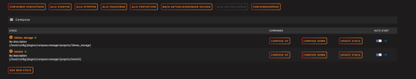
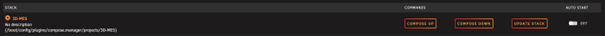
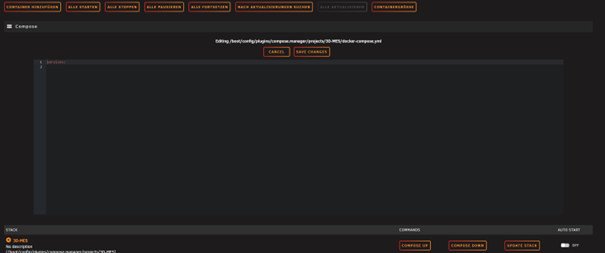
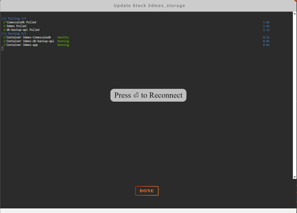

# 3D-MES auf Unraid – Installationsanleitung

## Voraussetzungen

Voraussetzung für diese Anleitung ist ein **Unraid-System mit aktiviertem Docker** in den Standardeinstellungen, insbesondere mit dem Standard-Appdata-Pfad:

/mnt/user/appdata/

Abweichende Docker- oder Netzwerkkonfigurationen werden in dieser Anleitung **nicht berücksichtigt** und setzen entsprechendes Hintergrundwissen voraus.

Ebenfalls muss die **IP-Adresse des Unraid-Servers** bekannt sein.

---

## Docker Compose Manager installieren

Über den Community Appstore **„Apps“** wird das Plugin  
**Docker Compose Manager** installiert.

---

## Neuen Compose Stack anlegen

In der Docker-Übersicht sollte nun ganz unten ein Bereich **„Compose“** sichtbar sein.  
Wurde bisher noch kein Stack erstellt, sind hier entsprechend noch keine Einträge zu sehen.

1. Auf **„ADD NEW STACK“** klicken  
2. Einen beliebigen Namen vergeben  
3. Mit **„OK“** bestätigen

Nach kurzer Wartezeit erscheint eine Bestätigung, die ebenfalls mit **„OK“** geschlossen wird.

Der neue Stack ist nun in der Liste sichtbar.

---

## Compose-Datei einfügen

1. Auf das **Zahnrad** links neben dem Stack-Namen klicken  
2. **„EDIT STACK“** → **„COMPOSE FILE“** auswählen  

Eventuell muss wieder nach unten gescrollt werden.

Im nun sichtbaren Editor-Feld:

- den bestehenden Inhalt inkl. `services:` **vollständig löschen**
- den kompletten Inhalt von [dieser compose.yml](../compose.yml) einfügen 

Anschließend mit **„SAVE CHANGES“** bestätigen – der Editor schließt sich automatisch.

### Hinweis zu Pfaden
An mehreren Stellen der Compose-Datei werden Docker-Verzeichnisse nach

/mnt/user/appdata/3dmes

gemountet.

Sollten deine Docker-Einstellungen vom Standard abweichen, müssen diese Pfade entsprechend angepasst werden.

---

## UI Labels überspringen

Das Fenster **„Edit Stack UI Labels“** kann zunächst mit **„OK“** geschlossen werden.  
Dies betrifft lediglich die Optik und kann später angepasst werden.

---

## ENV-Datei konfigurieren

1. Erneut auf das **Zahnrad** klicken  
2. **„EDIT STACK“** → **„ENV FILE“**

Im Editor-Feld wird der Inhalt der Beispiel-Datei  
**`.env.example`** eingefügt und angepasst.

### Wichtige Hinweise zur Konfiguration

- **Ports**
  - Port **80** und **443** sind in der Regel bereits von Unraid belegt
  - In dieser Anleitung werden daher **8080** (HTTP) und **8443** (HTTPS) verwendet
- **MQTT**
  - Die Ports **1883 / 8883** sollten **unverändert bleiben**, da sie für die Kommunikation der Waagen benötigt werden

### Wichtige Variablen

- `TS_PASSWORD`  
  → Passwort der Datenbank
- `ADMIN_PASSWORD`  
  → Admin-Benutzerpasswort für 3D-MES
- `SERVER_IP` *(optional)*  
  → IP-Adresse des 3D-MES-Servers  
  Wird für HTTPS-Zertifikate benötigt, kann aber auch entfernt werden
- **E-Mail-Adresse**  
  → sollte mit der auf **3d-mes.com** verwendeten E-Mail-Adresse übereinstimmen

Nach Anpassung aller Werte mit **„SAVE CHANGES“** speichern.

---

## Stack starten

Nun kann der Stack mit **„COMPOSE UP“** gestartet werden.

Wenn alles ordnungsgemäß startet, sollten nach kurzer Zeit alle Dienste **grün** angezeigt werden.  
Je nach Systemleistung und Internetanbindung kann dies einen Moment dauern.

⚠️ **Hinweis:**  
Bei einer Erstinstallation kann die Anzeige von den Beispielen abweichen.  
In diesem Fall kann das Fenster dennoch mit **„DONE“** geschlossen werden.

---

## Zugriff auf 3D-MES

Dein 3D-MES ist nun erreichbar unter:

- **HTTP:**  
  `http://<deine-unraid-ip>:8080`
- **HTTPS:**  
  `https://<deine-unraid-ip>:8443`

Anschließend kannst du mit der offiziellen Anleitung **„Erste Einrichtung“** fortfahren:

👉 https://wiki.3d-mes.com/de/Installation/Einrichtung

---

## Hinweis zu Updates & Änderungen

Da es sich bei 3D-MES um ein **Early-Access-System** handelt, können sich einzelne Konfigurationsparameter ändern.

Bei Problemen empfiehlt es sich, die verwendete Compose-Datei mit der aktuellen offiziellen Version zu vergleichen:

👉 https://github.com/3dmes/3dmes/blob/main/docker-compose.yml

