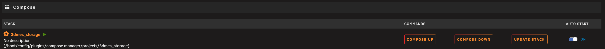

Für ein Update ist es lediglich erforderlich "update Stack" auszuführen

Wurden Updates installiert, muss nach dem Aufrufen der Seite wieder der Aktiverungscode von https://portal.3d-mes.com eingegeben werden.

Hinweis zum Aktivierungskey: Dieser ist nur einmalig Nutzbar - nach Verwendung oder dem Ablauf von 30 Tagen muss ein neuer Key generiert werden. Hierzu einfach die Seite https://portal.3d-mes.com neu laden
